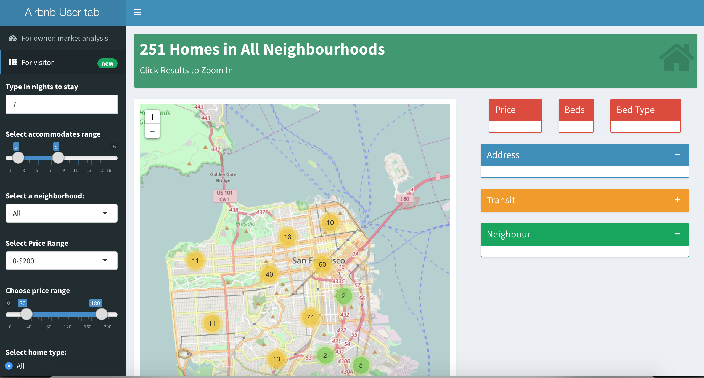

## Exploratory Data Analysis on Airbnb hosts data
- Helps visitors find desired homes  
- Helps hosts learn market information. 

Project Prototype: Airbnb host data inteactive dashboard
==============================

| **Name**  | Rui Li | Ruixuan Zhang  |
|----------:|:-------------|:-------------|
| **Email** | rli33@usfca.edu | rzhang45@usfca.edu  |

Instructions
----------------------

The following packages must be installed prior to running this code:

- `shinydashboard`
- `shiny`
- `leaflet`
- `geojsonio`


To run this code, please enter the following commands in R:

```
library(shiny)
shiny::runGitHub('DATAHelper-', 'usfviz', subdir='project-prototype')
```

This will start the `shiny` app. See below for details on how to interact with the visualization.


Discussion 
--------------------

Below are three screenshots of the interface of the shiny app.





## Data Set

This Airbnb data provides us with more than 20 columns that can be explore using shiny and leaflet. The aboudant information in
this data set can be used to answer serval interesting questions, such as generating insights and market report for hosts and recommending visitor a desired host!  

The original dataset can be found here http://insideairbnb.com/get-the-data.html. We cleaned and preprocessed the data. To suppliment market analysis [tab 1], we generated additional new features include the average rent price, average availibility rate and average rating of a single region. To help visitor find a desired host, we demonstrated useful and essential information on tab 2 and allowed user to filter by conditions. 

Type of data in the dataset numerical, categorical, longitude, latitude, text data. Original data are stored in csv file and geojson file. 

## Techniques

We tried to use as many techniques as possible.

Two major techniques that has been used are basemap ploted by leaflet and interactive dashboard that build on top of HTML. Some other techniques that are also being implemented to present detailed information are: scatter plot, dynamic content, interactive map that enable zoom in, popup on click, valueBox and filter by criteria. 

Ohter techniques that we might use in future are interactive pie chart, tables and infoBox. 

## UI

We have friendly user interface. On the left hand side of the dashboard, there's sidebar menu that allows user navigate between tabl [market analysis] and tab2 [for visitor: recommend hosts]. All filter criteria can be found in sidebar menu. The map is interactive which allows user to zoom in and click. On the right hand side of the dashboard, more detailed dynamic information is shown about the region or particular host.

## Summary

In the prototype, we implemented shiny dashboard and leaflet build two interactive analysis report using airbnb data. Additional analysis could be done by providing detailed information regarding appliance 


